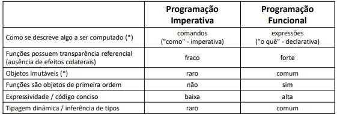

# Programação funcional e cálculo lambda
## Paradigmas de programação
• **Imperativo** (C, Pascal, Fortran, Cobol)

• **Orientado a objetos**  (C++, Object Pascal, Java (< 8), C# (< 3))

• **Funcional**  (Haskell, Closure, Clean, Erlang)

• **Lógico**  (Prolog)

• **Multiparadigma** (JavaScript, Java (8+), C# (3+), Ruby, Python, Go)

## Paradigma funcional de programação
Baseado no formalismo matemático Cálculo Lambda (Church 1930)
<p align="left">
    
</p>
## Transparência referencial
Uma função possui transparência referencial se seu resultado for sempre o mesmo
para os mesmos dados de entrada. Benefícios: simplicidade e previsibilidade.

Aqui abaixo é um Exemplo de função que não é referencialmente transparente
```java
package application;
import java.util.Arrays;

public class Program {
    public static int globalValue = 3;
    
    public static void main(String[] args) {
        int[] vect = new int[] {3, 4, 5};
        changeOddValues(vect);
        System.out.println(Arrays.toString(vect));
    }
    
     public static void changeOddValues(int[] numbers) {
        for (int i=0; i<numbers.length; i++) {
            if (numbers[i] % 2 != 0) {
                numbers[i] += globalValue;
            }
        }
     }
}
```
## Funções são objetos de primeira ordem (ou primeira classe)
Isso significa que funções podem, por exemplo, serem passadas como parâmetros de
métodos, bem como retornadas como resultado de métodos.
```txt
Utilizamos aqui
"method references"
Operador ::
Sintaxe:
Classe::método
```
```java
public class Program {

    public static int compareProducts(Product p1, Product p2) {
        return p1.getPrice().compareTo(p2.getPrice());
    }
    
    public static void main(String[] args) {
        List<Product> list = new ArrayList<>();
        
        list.add(new Product("TV", 900.00));
        list.add(new Product("Notebook", 1200.00));
        list.add(new Product("Tablet", 450.00));
       
        list.sort(Program::compareProducts);
        
        list.forEach(System.out::println);
    }
}
```
## Tipagem dinâmica / inferência de tipos
```java
public static void main(String[] args) {
  
    List<Product> list = new ArrayList<>();

    list.add(new Product("TV", 900.00));
    list.add(new Product("Notebook", 1200.00));
    list.add(new Product("Tablet", 450.00));

    list.sort((p1, p2) -> p1.getPrice().compareTo(p2.getPrice()));

    list.forEach(System.out::println);
}
```
## Expressividade / código conciso
```java
Integer sum = 0;
for (Integer x : list) {
    sum += x;
}
```
## vs.
```java
Integer sum = list.stream().reduce(0, Integer::sum);
```
## O que são "expressões lambda"?
Em programação funcional, expressão lambda corresponde a uma
função anônima de primeira classe.

```java
public class Program {

    public static int compareProducts(Product p1, Product p2) {
        return p1.getPrice().compareTo(p2.getPrice());
    }
    
    public static void main(String[] args) {

    (...)
    list.sort(Program::compareProducts);

    list.sort((p1, p2) -> p1.getPrice().compareTo(p2.getPrice()));
    
    (...)
```
## Resumo da aula
<p align="left">
    
</p>
Cálculo Lambda = formalismo matemático base da programação funcional

Expressão lambda = função anônima de primeira classe
